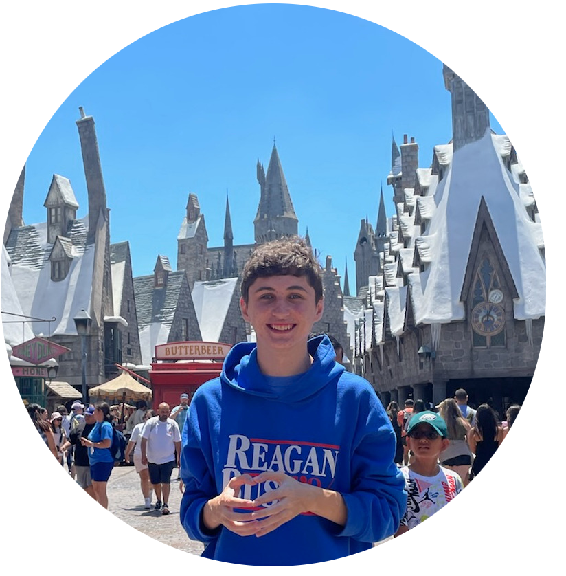
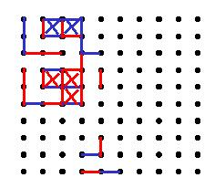

# Dustin O'Brien

"*Prospective Full-stack Software Engineer*"

<!-- Core Frameworks -->

### Achievements

 

# Table of Contents

# Description

Hello, My name is Dustin O'Brien I'm a recent Computer Science & Data Science graduate from Salisbury University with a focus in Software Engineering and Artificial Intelligence. With this knowledge I have developed a multiude of different AI applications, Websites, Research Projects and more. Outside of Computers I also enjoy Mathematics and Chess two topics which I have previously and plan to continue incorporate into my development as well as a desire to work with graphics and Linux.

My previous jobs an AI Research Contract with my University in partnership with Horn Point Labatories where I worked on developing LLM pipelines with LangChain in this role I focused on backend development creating initial pipelines such as a chatbot and personally developeed a Markdown document generator to simplify and collect information from a large set of interview transcripts relating to Salt Concentration of Water. I have also worked as the Assistant to my universities System Adminstrator where I setup new computer labs as well as coding Pytorch based LLM benchmarks to be ran on Salisbury & UMBC High Performance Computer Systems. Lastly, I worked 2 tutoring postions as both a dedicated Computer Science tutor for the entire CS department course catalog and a Math & Computer Science tutor which included teaching Salisbury's entry level Math and Computer Science positions.

In my 4 years of Coding and 2 years of Software Development I have managed an impressive list of accomplishments including having won winning 2 hackathons

- HenHack 2024 (Bank of America's Best Financial Hack) - Lambda Check
- HackUMBC 2024 (Best Educational Hack & Second Best Overall Hack) - Testif.AI

As well as participating in HenHack 2025 & HoyaHacks 2025. Alongside this I also was awarded as a Certified Cloud Practitioner by AWS via the AWS Skill builder program where I learned a lot of the fundamental services provided by the Amazon Cloud Provider. I am also a repeately been on Salisbury's Dean's List graduating with a final GPA of 3.608.

### Feel Free to Contact me at

- Email: [dustintobrien@gmail.com](mailto:dustintobrien@gmail.com)

- Phone Number: [(240) 678-3366](tel:+12406783366)

- Personal Website / Portfolio: [dustintobrien.com](https://dustintobrien.com)

# Projects

### Web Development

    
Web Dev Projects

    <h3>Chapp.</h3>
    
    <a href="https://github.com/Omniladder/Chapp/">Link To Project</a>
    <h3>Portfolio Site</h3>
    
    <a href="https://github.com/Omniladder/Portfolio_Website/">Link To Project</a>
    <h3>Testif.AI</h3>
    
    <a href="https://github.com/SpencerPresley/TestifAI">Link To Project</a>
    <h3>Flashcard Factory</h3>
    
    <a href="https://github.com/cbarbes1/HenHacks2025">Link To Project</a>
    <h3>Resume.AI</h3>
    
    <a href="https://github.com/SpencerPresley/HoyaHacks2025">Link To Project</a>
    <h3>Celite</h3>
    
    <a href="https://github.com/ktranfaglia1/Celite/">Link To Project</a>

### Artificial Intelligence

AI & ML Projects

    
Websites

    <h3>Saltcast Chatbot</h3>
    
    <h3>Testif.AI</h3>
    
    <a href="https://github.com/SpencerPresley/TestifAI">Link To Project</a>
    <h3>Flashcard Factory</h3>
    
    <a href="https://github.com/cbarbes1/HenHacks2025">Link To Project</a>
    <h3>Resume.AI</h3>
    
    <a href="https://github.com/SpencerPresley/HoyaHacks2025">Link To Project</a>

    
Research

     <h3>Attention Chess Bot</h3>
    
    <a href="https://github.com/Omniladder/Attention_Chess_Bot">Link To Project</a>
    <h3>Pakistan Women Voters</h3>
    
    <a href="https://github.com/Omniladder/Pakistan_Elections">Link To Project</a>
    <h3>Sports Classification</h3>
    
    <a href="https://github.com/ktranfaglia1/SportClassification">Link To Project</a>
    <h3>Multi-modal ToT Reasoning Adapter</h3>
    
    <h3>Salinity Markdown Doc. Generator</h3>
    

### DevOps + Linux

    
DevOps + Linux Projects

    <h3>Lambda Check</h3>
    
    <a href="https://github.com/Omniladder/Dustin_Lambda_Check">Link To Project</a>
    <h3>Proxmox Server</h3>
    <!--TODO: Get Screenshot of Proxmox Server-->
    <!--  -->
    <h3>Arch Linux</h3>
    
    <h3>AWS Server Hosting</h3>
    
    <a href="https://www.credly.com/badges/8cf1deed-daef-42fc-ba61-954070d82a20/public_url">Link To Certificate</a>

### Mathematics

    
Mathematics Projects

    <h3>Celite</h3>
    
    <a href="https://github.com/ktranfaglia1/Celite/">Link To Project</a>
    <h3>Taylor Series Visualization</h3>
    
    <a href="https://github.com/Omniladder/TaylorSeriesVisualization">Link To Project</a>
    <h3>Pi Approximation Calculators</h3>
    
    <a href="https://github.com/Omniladder/Small-Projects">Link To Project</a>

### Miscellaneous

    
Miscellaneous Projects

    <h3>Flashcard App</h3>
    
    <a href="https://github.com/ncorcoran771/FlashcardApp">Link To Project</a>
    <h3>Battleship Game</h3>
    
    <a href="https://github.com/Omniladder/Battleship">Link To Project</a>
    <h3>Parallized Database</h3>
    
    <a href="https://github.com/ktranfaglia1/QueryParser">Link To Project</a>
    <h3>Dots and Boxes Solver</h3>
    
    <a href="https://github.com/Omniladder/Small-Projects/tree/master/dotsNBoxes">Link To Project</a>

